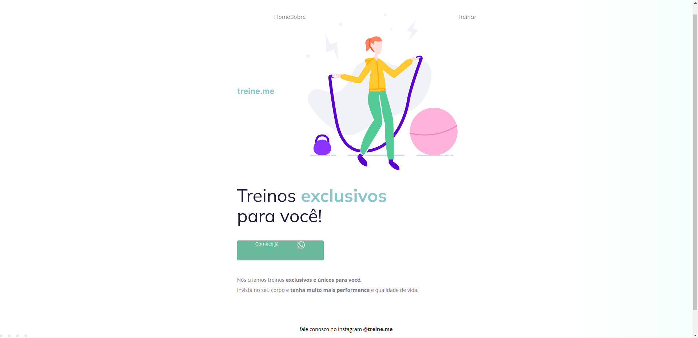

<h1 align="center"> 👨🏼‍💻Iniciante - Corrigindo bugs (02) 👀 
    🚀👨🏼‍🚀#Desafios Rocketseat </h1>

  <a href="#-projeto">Projeto</a>&nbsp;&nbsp;&nbsp;|&nbsp;&nbsp;&nbsp;
  <a href="#-tecnologias">Tecnologias</a>&nbsp;&nbsp;&nbsp;&nbsp;&nbsp;&nbsp;

 

## 💻 Projeto

Esse projeto consiste em um desafio do Explorer da Rocketseat,onde devemos consertar um código do
[projeto-02-explorer](https://github.com/PabloPerdigao/Desafio-Exploerer-Corrigindo-bugs-Projeto-02),que sofreu algumas alterações e, como podemos ver na imagem abaixo, ele não é mais da mesma forma que o Maykão ensinou na aula. 

  

## 🚀 Tecnologias

Esse projeto foi desenvolvido com as seguintes tecnologias:

- HTML e CSS
- Git e Github

---

😉 Feito com ♥ by Pablo Perdigão,aluno Explorer da Rocketseat!
 📲 [Participe da comunidade Rocketseat!](https://discord.gg/rocketseat)

